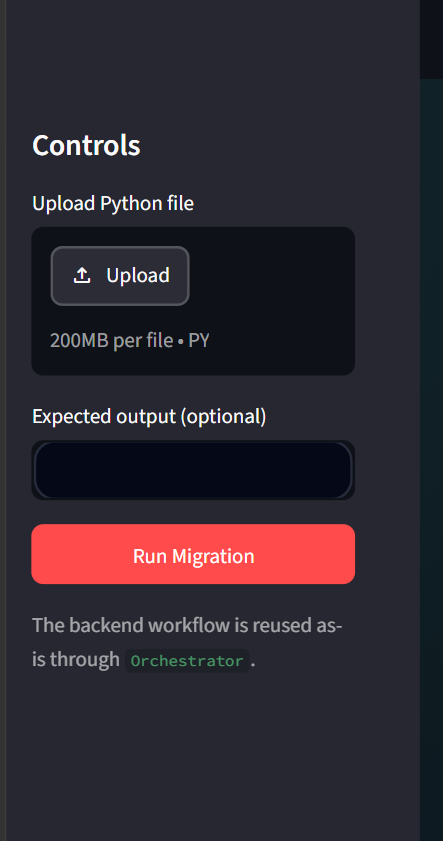
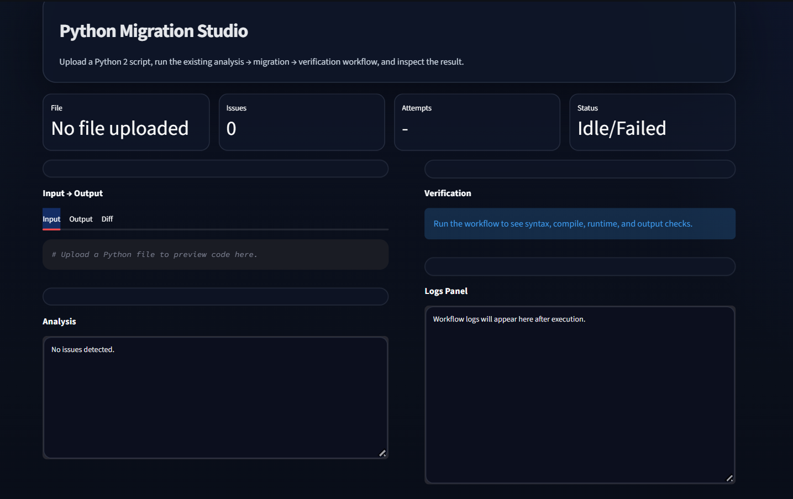
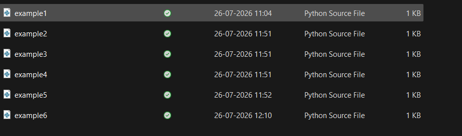
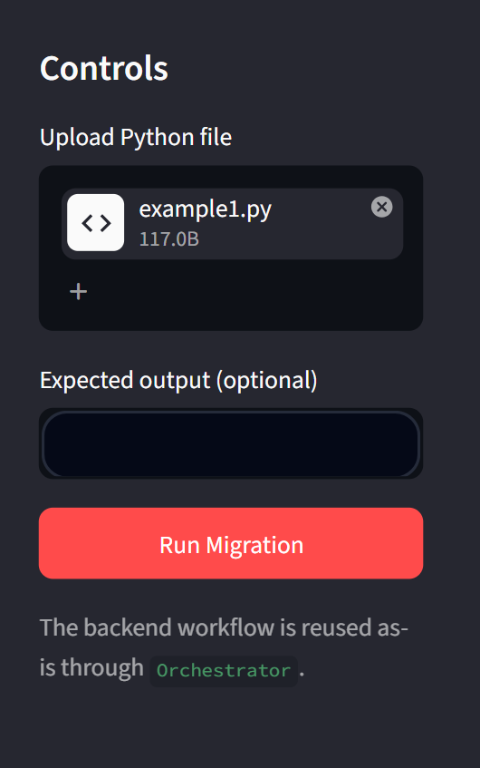
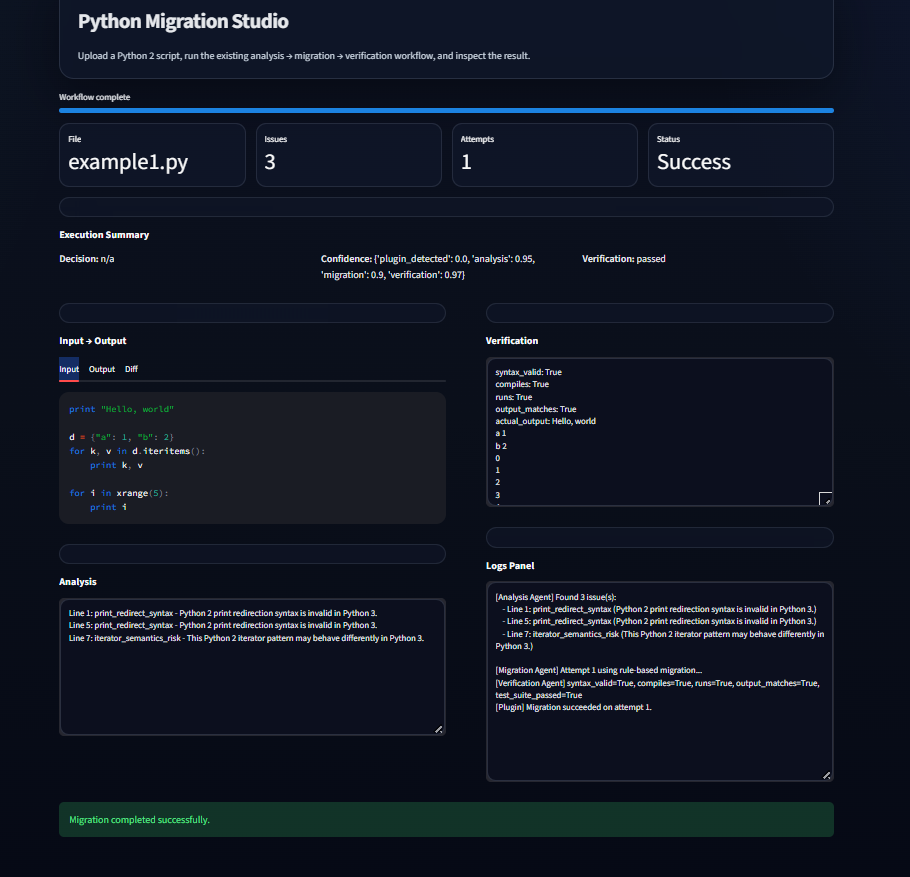

# 🤖 Agentic Code Migration Framework

### Automated Legacy-to-Modern Code Migration Using Static Analysis and LLM Agents

An intelligent **agentic code migration framework** designed to automate the transformation of legacy Python code into modern, executable code.

The framework combines **static analysis, AST-based code understanding, LLM-powered migration, automated verification, and an orchestration layer** to create a reliable migration pipeline.

---

## 🚀 Overview

Legacy software often contains outdated syntax, deprecated constructs, and compatibility issues that make modernization difficult and time-consuming.

The **Agentic Code Migration Framework** addresses this problem by using multiple specialized AI agents that collaborate throughout the migration process.

Instead of relying on a single LLM prompt, the framework follows a structured pipeline:

**Analyze → Migrate → Verify → Retry → Deliver**

This allows generated code to be automatically checked and corrected before being presented to the user.

---

## 🎯 Problem Statement

Migrating legacy code manually can be:

* Time-consuming
* Error-prone
* Difficult to validate
* Dependent on developer expertise
* Challenging when dealing with large codebases

Traditional automated migration tools may perform direct syntax transformations but often lack the ability to understand context, generate modern alternatives, and verify whether the migrated program actually works.

This project aims to combine **static analysis with agentic LLM-based reasoning** to make code migration more automated and reliable.

---

## 💡 Proposed Solution

The framework uses specialized agents, each responsible for a specific stage of the migration process.

### 🔍 Analysis Agent

Analyzes the legacy source code and identifies migration-relevant constructs using:

* Pattern-based detection
* Python AST parsing
* Structural code analysis

The analysis results provide evidence that guides the migration process.

### 🧠 Migration Agent

Uses an LLM to transform the legacy code into a modern equivalent.

The agent receives the original source code together with the analysis evidence and generates the migrated implementation.

### ✅ Verification Agent

Automatically validates the generated code through multiple checks, including:

* Syntax validation
* Compilation checks
* Program execution
* Output verification

This prevents incorrect generated code from being accepted without validation.

### 🎛️ Orchestrator

Coordinates the complete agent pipeline.

If verification fails, the orchestrator can send the migration process through another correction cycle using the verification feedback.

---

## 🏗️ System Architecture

```text
                    ┌──────────────────────┐
                    │     Legacy Code      │
                    └──────────┬───────────┘
                               │
                               ▼
                    ┌──────────────────────┐
                    │   Analysis Agent     │
                    │                      │
                    │ AST + Pattern        │
                    │ Based Analysis       │
                    └──────────┬───────────┘
                               │
                         Analysis Evidence
                               │
                               ▼
                    ┌──────────────────────┐
                    │   Migration Agent   │
                    │                      │
                    │   LLM-Based Code     │
                    │     Migration        │
                    └──────────┬───────────┘
                               │
                         Migrated Code
                               │
                               ▼
                    ┌──────────────────────┐
                    │ Verification Agent  │
                    │                      │
                    │ Syntax              │
                    │ Compilation         │
                    │ Execution           │
                    │ Output Validation   │
                    └──────────┬───────────┘
                               │
                       ┌───────┴────────┐
                       │                │
                    Valid           Invalid
                       │                │
                       ▼                ▼
                 ┌──────────┐    ┌────────────┐
                 │  Output  │    │ Correction │
                 │  Code    │◄───│   Cycle    │
                 └──────────┘    └────────────┘
```

---

## 🔄 Workflow

```text
Legacy Source Code
        ↓
Static Analysis
        ↓
Migration Evidence
        ↓
LLM-Based Transformation
        ↓
Generated Modern Code
        ↓
Automated Verification
        ↓
   ┌───────────────┐
   │ Verification  │
   │    Passed?    │
   └───────┬───────┘
       Yes │ No
           │
       ↓   └──────────→ Migration Correction
       │                         ↓
       │                    Re-verification
       ↓
Final Migrated Code
```

---

## 📊 Current Results

The framework is currently operational across the complete migration pipeline.

### Analysis

* ✅ Detects legacy Python constructs.
* ✅ Uses AST parsing to understand source-code structure.
* ✅ Produces migration evidence for downstream agents.

### Migration

* ✅ Generates modernized code using an LLM.
* ✅ Uses analysis information to guide code transformation.
* ✅ Supports local LLM inference through Ollama.

### Verification

* ✅ Performs syntax validation.
* ✅ Performs compilation checks.
* ✅ Executes generated programs.
* ✅ Compares execution results for correctness.

### Orchestration

* ✅ Coordinates the complete agent pipeline.
* ✅ Handles verification failures.
* ✅ Supports automated correction cycles.
* ✅ Connects analysis, migration, and verification into a single workflow.

### User Interface

* ✅ Supports legacy-code upload.
* ✅ Provides a migration execution interface.
* ✅ Displays analysis results.
* ✅ Displays migrated code.
* ✅ Displays verification results.
* ✅ Provides before/after code comparison and diff visualization.

> **Note:** The current results represent the development-stage evaluation of the framework. Detailed benchmark metrics and comparative experiments will be added as the evaluation is finalized.

## 📸 Results and Screenshots

The following screenshots demonstrate the working interface and end-to-end execution of the Agentic Code Migration Framework, covering legacy Python code upload, analysis, migration, verification, and successful execution.

### 1. Legacy Python Code Upload Interface



**Figure 1: Migration Control Interface**

The application provides an interface for uploading legacy Python source files. Users can optionally provide the expected program output and start the automated migration workflow using the **Run Migration** button. The workflow is coordinated through the framework's orchestration layer.

---

### 2. Python Migration Studio Dashboard



**Figure 2: Python Migration Studio**

The migration studio provides a centralized view of the migration process. It displays the uploaded file, detected issues, migration attempts, workflow status, input and output sections, analysis results, verification information, and workflow logs.

---

### 3. Legacy Python Test Input Files



**Figure 3: Legacy Python Test Files**

Multiple Python source files are used as test inputs for evaluating the migration framework. These examples provide legacy-code inputs for testing the analysis, migration, and verification stages.

---

### 4. Legacy Python File Uploaded



**Figure 4: Uploaded Legacy Python Source File**

The `example1.py` legacy Python source file is uploaded to the migration studio and is ready to be processed by the automated analysis, migration, and verification workflow.

---

### 5. Successful Migration and Verification



**Figure 5: Successful End-to-End Migration Result**

The final screenshot demonstrates successful execution of the complete migration workflow. The framework identifies legacy Python constructs during analysis, performs code migration, and verifies the generated program.

The result shows:

* **Status:** Success
* **Attempts:** 1
* **Issues detected during analysis:** 3
* **Syntax validation:** Passed
* **Compilation:** Passed
* **Runtime execution:** Passed
* **Output matching:** Passed
* **Migration:** Completed successfully

The **Analysis** panel reports the detected legacy constructs. The **Verification** panel confirms syntax, compilation, runtime, and output checks. The **Logs Panel** provides execution traceability across the workflow agents.

### 🔄 End-to-End Migration Workflow

```text
Legacy Python Code
        ↓
File Upload
        ↓
Static Analysis
        ↓
Code Migration
        ↓
Verification
        ↓
Runtime Execution
        ↓
Output Validation
        ↓
Successful Migration
```

These results demonstrate the framework's ability to combine agent-based analysis, automated code migration, verification, and orchestration into a unified legacy-code modernization workflow.

---

## 🛠️ Technology Stack

| Category             | Technologies          |
| -------------------- | --------------------- |
| Programming Language | Python                |
| AI / LLM             | Ollama, Qwen2.5-Coder |
| Code Analysis        | Python AST            |
| Interface            | Streamlit             |
| Testing              | PyTest                |
| Version Control      | Git, GitHub           |
| Architecture         | Multi-Agent System    |
| Execution Validation | Python Runtime        |

---
## ✨ Key Features

* 🤖 Multi-agent architecture
* 🔍 Static analysis of legacy source code
* 🌳 AST-based code analysis
* 🧠 LLM-powered code migration
* 🔄 Automated correction and retry workflow
* ✅ Syntax and compilation validation
* ▶️ Runtime execution verification
* 📊 Output correctness checking
* 📝 Before-and-after code comparison
* 🔎 Code diff visualization
* 🖥️ Streamlit-based user interface
* 🧩 Modular agent architecture

---


## 📁 Project Structure

```text
Agentic-Code-Migration-Framework/
│
├── agents/
│   ├── analysis_agent.py
│   ├── migration_agent.py
│   └── verification_agent.py
│
├── orchestrator/
│   └── orchestrator.py
│
├── tests/
│
├── app.py
├── requirements.txt
├── README.md
└── ...
```

> The project structure may evolve as additional modules and experiments are added.

---

## 🚧 Future Enhancements

* Support for additional legacy programming languages
* More sophisticated AST-based transformations
* Improved migration context generation
* Larger benchmark datasets
* Comparative evaluation with existing migration approaches
* Human-in-the-loop migration review
* Repository-level code migration
* Dependency-aware migration
* Advanced semantic equivalence checking
* Migration history and reporting

---

## 🎓 Project Type

**Academic / Research Project**

**Domain:** Artificial Intelligence · Generative AI · Software Engineering · Agentic AI · Program Analysis

---

## 👩‍💻 Author

**Baigaru Radhika**

Computer Science Engineering — Artificial Intelligence & Machine Learning

---

